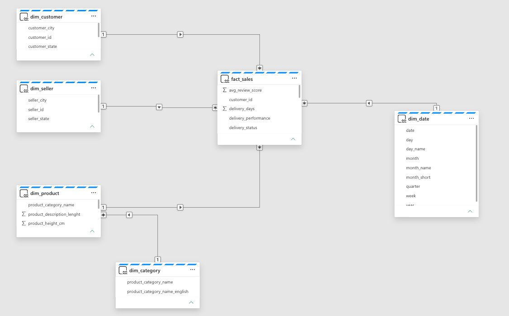

# Data Model

## Overview

The Gold layer follows a **Star Schema** dimensional model designed to support fast, scalable, and business-friendly reporting in Power BI.

The model consists of **fact tables** that store measurable business events and **dimension tables** that provide descriptive attributes for filtering, grouping, and analysis.

This design minimizes redundancy, improves query performance, and simplifies analytical reporting.

---

## Data Model Overview

The analytical model consists of:

### Fact Tables

- **fact_sales**
  - Stores order-level sales transactions, delivery information, and customer review metrics.
- **fact_payments**
  - Stores payment details, payment methods, installments, and payment values.

### Dimension Tables

- **dim_customer**
- **dim_product**
- **dim_category**
- **dim_seller**
- **dim_geography**
- **dim_date**

---

## Star Schema

The model follows a Star Schema where the fact tables are connected to shared dimensions.

```
                 dim_date
                     │
                     │
dim_customer ── fact_sales ── dim_product
                     │
                     │
             dim_category
                     │
                     │
               dim_seller
                     │
                     │
             dim_geography


                 fact_payments
                      │
                 order_id
```

---

## Design Principles

The data model was designed using the following principles:

### Separation of Facts and Dimensions

Business transactions are stored in fact tables, while descriptive attributes are stored in dimensions.

### Single Source of Truth

Each business entity exists only once, reducing redundancy and ensuring consistency.

### Optimized for Analytics

The model supports efficient filtering, aggregations, and drill-down analysis in Power BI.

### Scalability

Additional dimensions and fact tables can be added without redesigning the existing model.

---

## Relationships

The semantic model is built using one-to-many relationships between dimensions and facts.

| From | To | Relationship |
|------|----|--------------|
| dim_customer | fact_sales | One-to-Many |
| dim_product | fact_sales | One-to-Many |
| dim_category | dim_product | One-to-Many |
| dim_seller | fact_sales | One-to-Many |
| dim_geography | dim_customer | One-to-Many |
| dim_date | fact_sales | One-to-Many |

The **fact_payments** table remains independent and is used specifically for payment-related analysis.

---

## Benefits

The dimensional model provides:

- Improved query performance
- Simplified report development
- Consistent business definitions
- Reduced data redundancy
- Better scalability
- Faster analytical queries

---

## Entity Relationship Diagram

The complete Entity Relationship Diagram (ERD) is available below.



---

## Related Documentation

- documentation/Dimension_Tables.md
- documentation/Fact_Tables.md
- documentation/Gold.md
